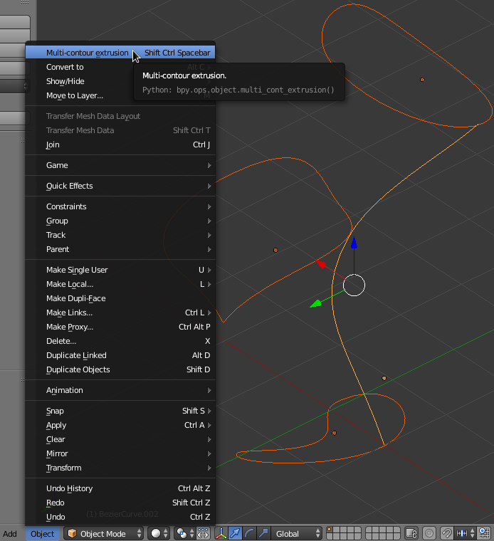
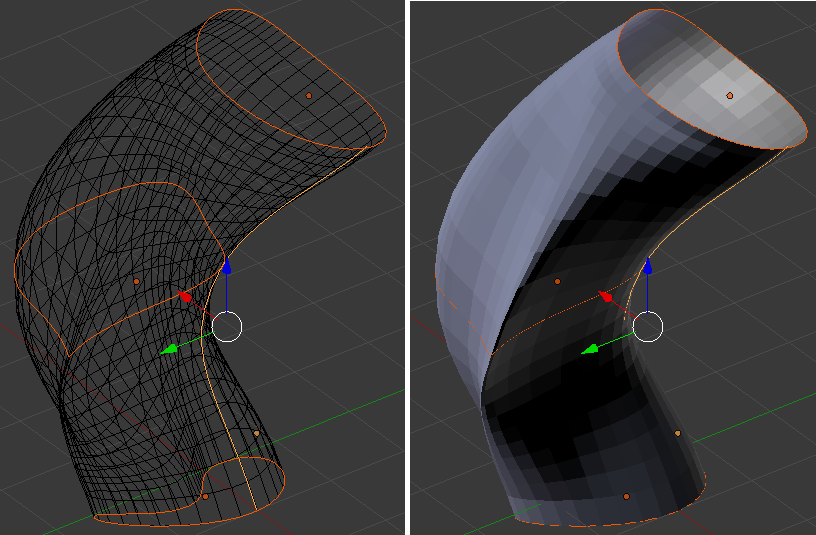
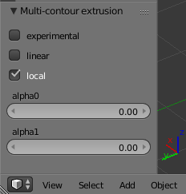
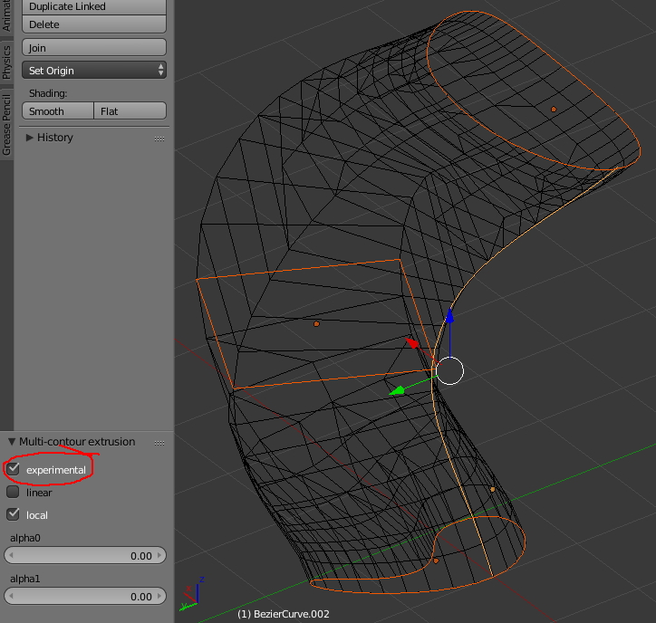
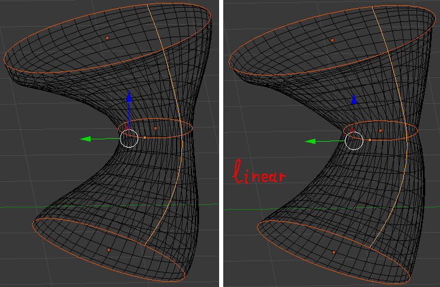
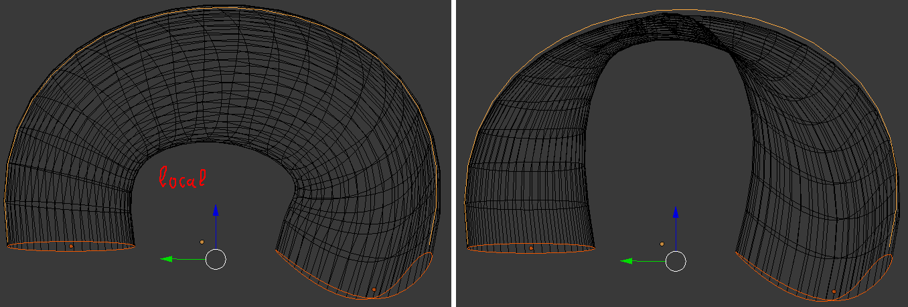
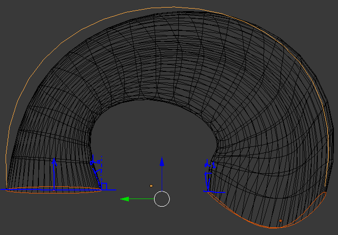

# multi-contour-extrusion
blender 2.79 add-on that is capable to create extruded geometries following path and going exactly through given number of contours. input can be both mesh and curve or even mixed

### Usage
create a set of contours with bezier curves or but direct editing of mesh. do not try to set new points in any specific order add-on will reorder them using edge adjacency (example: add a simple plane, subdivide individual edges, distort the cotour as you like feel free to remove face, but keep the edges, make sure your does not produce non-manifold geometry)

create a path also using bezier spline or mesh. cyclic pathes are not supported yet. it should work, but you have to stirch last segment manually.

select all your contours (order of selection does not play any role), finally select the path to make it active (path is yellow all the contours are orange) and run add-on from 3D view->Object->Multi-Contour Extrusion

​

play with settings. if your contours have different number of vertices you will get error message and no output. just tick "experimental" checkbox in left tab (Multi-Contour extrusion settings)

### Usage

##### Basic usage:

##### Settings
The default settings pannel is:

###### Experimental (contours with different number of vertices)
By default "experimental" feature is turned off so only contours with same number of vertices are supported. Ticking "experimental" will instantlyy rerun add-on in this mode and you supposed to get the output. Consider the following tube with squre crossection in the middle:

Note that add-on does not create any extra points on contours, instead it remesh the area in-between the contours to match given input.

###### Linear
In-between given contours add-on creates​ new sub-contours for each path(seam) vertex. New sub-contours smoothly follow curved the path and are transformed in order to match given first and last contours of sub-path (path between pair of subsequent given contours). Transforation can be linear or smooth. But default it is smooth but can be switched to basic linear. Consider the difference:

###### Local
Local is more sophisticated thing. When creating sub-contours over the path they are transformed to follow the path, this transformation can be done in global space or in local space attached to each path vertex. Local means that transformation is done in local space for each path vertex. The most dramatic difference can be seen in bridge geometries:

##### Angles
Angles alpha0 and alpha1 control the tendency of the tube to shrink or to widen at endpoint contours. Angles work on in non linear mode. Actually these two angles are missing unknown parameters for spline smoothing of contours when building sub-contours. Note that you cannot fully control spline handle, it is just a slope. Setting something close to 90 produce runaway tubes.

##### Best practices
* in "local" mode try to avoid pathes that are non perpendicular to contours. consider change seam position along contours polar angle it may help with overlapping.
* in "experimental" mode avoid contours with dramatic changes in seeding e.g. when starting contour has very long edges ending contour is evenly seed for certain path curvature newly inserted mesh veritves will drop off the surface and produce steps.
* consider creting tube segment by segment to control slope with alpha0 and alpha1, tube perfectly match given contours so after "joining" and removing doubles for final object you supposed to get custom sloped tube.
* one interesting paradox that is not evident:

what is happening is wrong detection of closest vertex of the first contour to the path. due to the shape of contour it detects oppsote vertex so starting and ending contours become twisted. the solution is to carefully check seeding, in this particular example long edge have to be subdivided.
